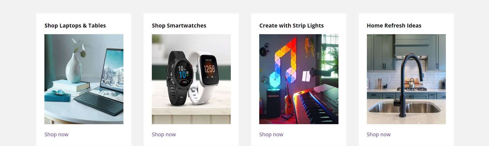

# Amazon Hero Page

## Description
This project recreates a hero page similar to Amazon's using HTML and CSS. It includes a navigation bar, a hero section, and product cards with a zoom-in effect on hover.

## Technologies Used
- HTML
- CSS

## Hosted Link
[Live Demo](https://deepesh-pundir8898.github.io/Weekly_test-5/)

## HTML and CSS Details

### Header
- **HTML Tags**: `<header>`, `<nav>`, `<ul>`, `<li>`, `<a>`
- **CSS Properties**: `background-color`, `color`, `padding`, `display`, `float`, `text-decoration`
## Screenshot

### Hero Section
- **HTML Tags**: `<section>`, `
`
- **CSS Properties**: `background-image`, `background-size`, `background-position`, `height`, `color`, `text-align`, `display`, `justify-content`, `align-items`, `padding`, `border-radius`

## Screenshot

### Cards
- **HTML Tags**: `<section>`, `
`, ``, `<h3>`, `
`
- **CSS Properties**: `background-color`, `border`, `border-radius`, `padding`, `width`, `text-align`, `transition`, `transform`

## Screenshot

### footer
- **HTML Tags**: `<footer>`, `
`, `<h3>`, `<a>`
- **CSS Properties**: `background-color`, `border`,  `padding`, `width`, `text-align`, `transition`,`justify-content`

## Screenshot

## Video Explanation
[Video Link](https://your-video-link.com)
